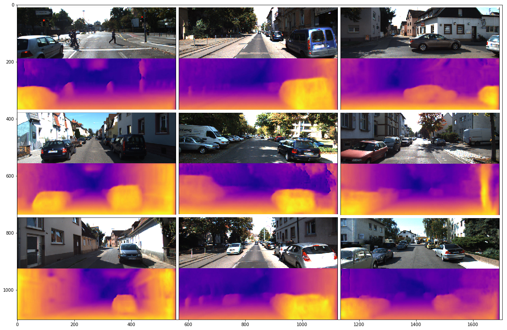

# DepthEstimation
Unsupervised monocular depth estimation inspired by the paper: https://arxiv.org/pdf/1609.03677.pdf and implementation: https://github.com/mrharicot/monodepth
## Requirements
Python packages that are used:
- torch 1.8.0
- tensorboardX 2.1
- opencv-python 4.1.1.26
- numpy 1.18.5
- matplotlib 3.3.4
- PyYAML 3.12
- tqdm 4.41.1
- json 3.13.2

## Data
Dataset that is used is [KITI dataset](http://www.cvlibs.net/datasets/kitti/). Dataset is divided in two parts: training
and validation. Paths to images are written in json files for both training and validation dataset. Example of the 
several lines is shown below:
```
[
  [
    "~/Datasets/depth/KITTI/images/2011_09_30/2011_09_30_drive_0028_sync/image_02/data/0000002322.png",
    "~/Datasets/depth/KITTI/images/2011_09_30/2011_09_30_drive_0028_sync/image_03/data/0000002322.png"
  ],
  [
    "~/Datasets/depth/KITTI/images/2011_10_03/2011_10_03_drive_0034_sync/image_02/data/0000002895.png",
    "~/Datasets/depth/KITTI/images/2011_10_03/2011_10_03_drive_0034_sync/image_03/data/0000002895.png"
  ],
  ...
]
```
The first path is path to the left image and the second path is path to the right image.
## Training
To run training run script train.py: ```python train.py --config config.yaml```
Explanation of some fields in the config file:
- Dataset: train_data_path - Path to json file with images from training dataset
- Dataset: val_data_path - Path to json file with images from validation dataset
- Dataset: image_size - Input size of the network. It is recommended to be divisible by 128
- Train: evals_per_epoch - How many times to validate model during one epoch. For example, if 2 is provided validation 
will be run two times during each epoch. Also this parameter defines how many models will be saved during each epoch.
- Train: lr_scheduler - Learning rate scheduler. Value ```lr_init``` defines initial learning rate for every 
learning rate scheduler. Field ```use``` is boolean variable which means to use or not specified learning rate scheduler.
If every learning rate scheduler have value ```True``` in the field ```use``` then ```lr_init``` will be used during 
whole training.
- Train: pretrained - Path to the model that will be loaded on the beginning of the training
- Train: device - GPU id. Currently not supported training with multiple GPUs
- Train: architecture - Network architecture. Currently supported: resnet34, resnet50, resnet101, resnet152
- Train: augmentation - Augmentation method. For each augmentation method is needed to provide parameter p which 
represents probability of using that augmentation method
- Loss - Loss weights for each part of the loss
- Logging: tb_logdir - Path to directory for storing tensorboard logs
- Logging: ckpt_dir - Path to directory for storing checkpoints during training
Metrics are monitored during training using tensorboard. To run tensorboard go to the directory where are logs and run 
```tensorboard --logdir .```. Then in the browser type ip address and port in the format ```123.456.78:6006```.
If not specified default port is 6006.

Training and validation splits are provided in the data folder.

## Inference
To evaluate model on the videos or on the images run ```python inference.py``` with the following arguments:
```
--source 
    Path to images. If json file is provided - calculate metrics. If directory is provided the output can be video 
or images with predictions
--architecture
    Model architecture that is used during training
--model_path 
    Path to the model
--device 
    GPU id
--image_size 
    Input size of the network in the format WxH
--min-depth
    Minimum value for depth. Default: 0.001
--max-depth
    Maximum value for depth. Default: 80
```
## Results
Metrics that are presented is metrics from the paper: https://arxiv.org/pdf/1406.2283.pdf. The table below shows results.
<br/>

| metric                       | value  |
| :--------------------------- | :----- |
| Absolute Relative Difference | 0.101  |
| Squared Relative Difference  | 1.132  |
| RMSE (linear)                | 5.884  |
| RMSE (log)                   | 0.213  |
| RMSE (scale-invariant) - D1  | 24.877 |
| ∂ < 1.25                     | 0.86   |
| ∂ < 1.25 <sup>2</sup>        | 0.933  |
| ∂ < 1.25 <sup>3</sup>        | 0.954  |

Those metrics are obtained with resnet50 netowrk as a decoder.

<br/>

Images below are examples from the dataset with predictions.

